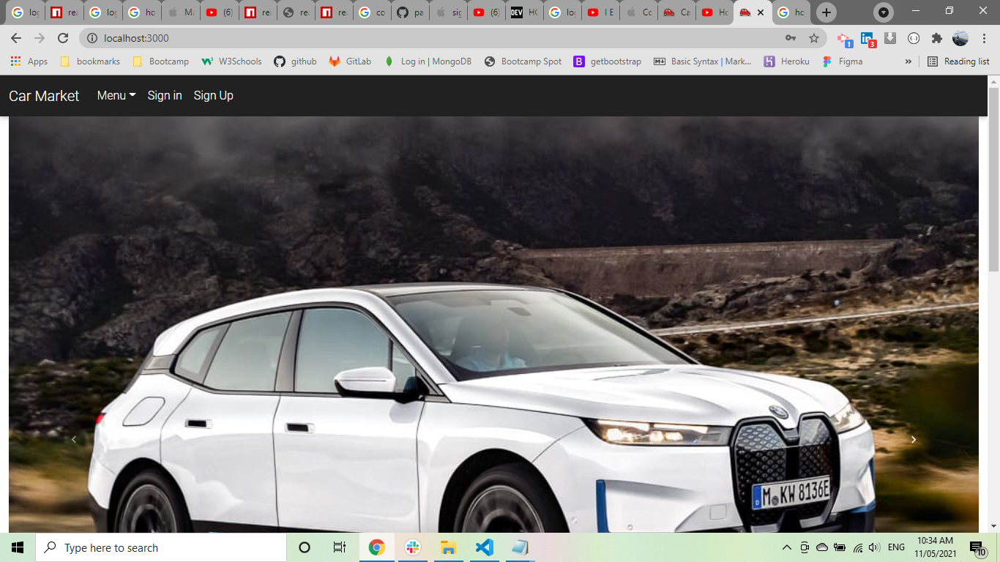
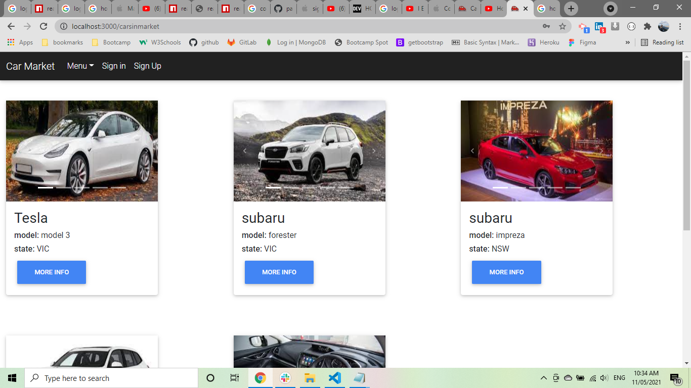
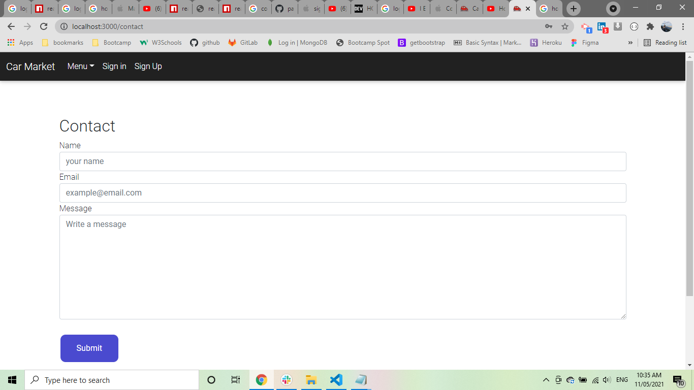
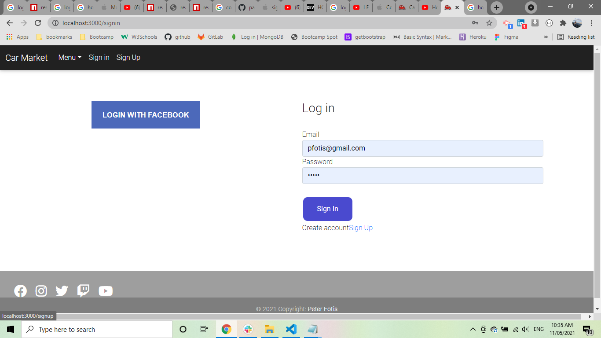

# Car Market

* [links](#links)
* [Description](#description)
* [Built With](#builtwith)
* [Installation](#installation)
* [Screenshots](#screenshots)
* [Questions](#questions)

## links

[Repository link](https://github.com/pfotis/car-market)

[website link](https://boiling-wildwood-96371.herokuapp.com)

## Description

    The Car Market is a website could help and support the user to sell or buy a car. There
    is a form where the user could fill and upload images and the next minute to publish his/her
    car for sale. The user could buy car there is a page where he/she can find all the car at this
    moment. Additional there is contact form to ask form more information or help. The user could login 
    with the facebook without spent time to type name, email and password.

## Built With

    React.js
    HTML
    Bootstrap
    CSS
    Javascript

## Installation

    npx create-react-app client
    npm install react-bootstrap bootstrap
    npm install bootstrap-css-only
    npm install antd
    npm install mdbreact
    npm install axios
    npm install dotenv
    npm install cloudinary-react
    npm install bootstrap@next
    npm install passport
    npm install passport-local
    npm install passport-facebook
    npm install --global yarn

## Screenshots

    With the following pictures the user could see the outfit of this project.

   

   

   

## Questions

    For any questions about this repository, please contact me at pfotis@gmail.com
    View my work in GitHub pfotis(https://github.com/pfotis)